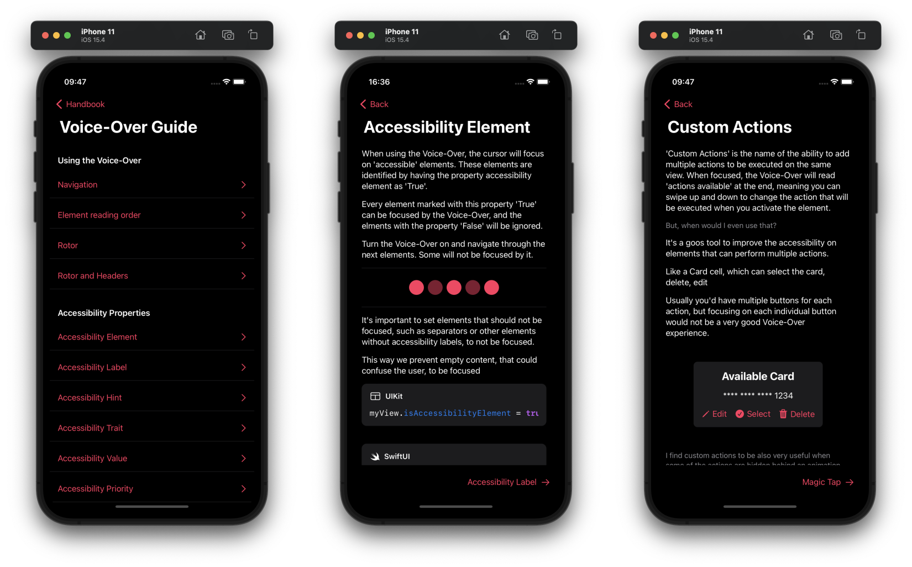

# iOS Accessibility Handbook

An iOS Accessibility guide, demonstrating several accessibility features, how to use and how to implement them with examples in UIKit and SwiftUI.

## About

The Accessibility Handbook started as an idea with some colleagues and friends, aiming to be an easy way to learn more about iOS accessibility features and how to implement them.

### Guides

Find an extensive documentation of accessibility features and how to implement them with real-life examples.

### The Handbook Game

The **Handbook Game** is a series of short puzzles to test your accessibility knowledge.
They are built not to be hard, but to be examples of how some accessibility settings can be used and how they impact the users.

> Have an ideia for a new puzzle? [Submit an issue](https://github.com/giovaninppc/AccessibilityHandbook/issues/new)

## How to run

### Requirements
- Xcode 13.0+

### Getting Started
- Clone this repository
- Open the .xcodeproj and you are good to go.

## Contributing

Feel free to [open an issue](https://github.com/giovaninppc/AccessibilityHandbook/issues/new) or [submit a pull request](https://github.com/giovaninppc/AccessibilityHandbook/compare) if you have any improvement or feedback.

### Author

Giovani Pereira, giovani.x.pereira@gmail.com.
